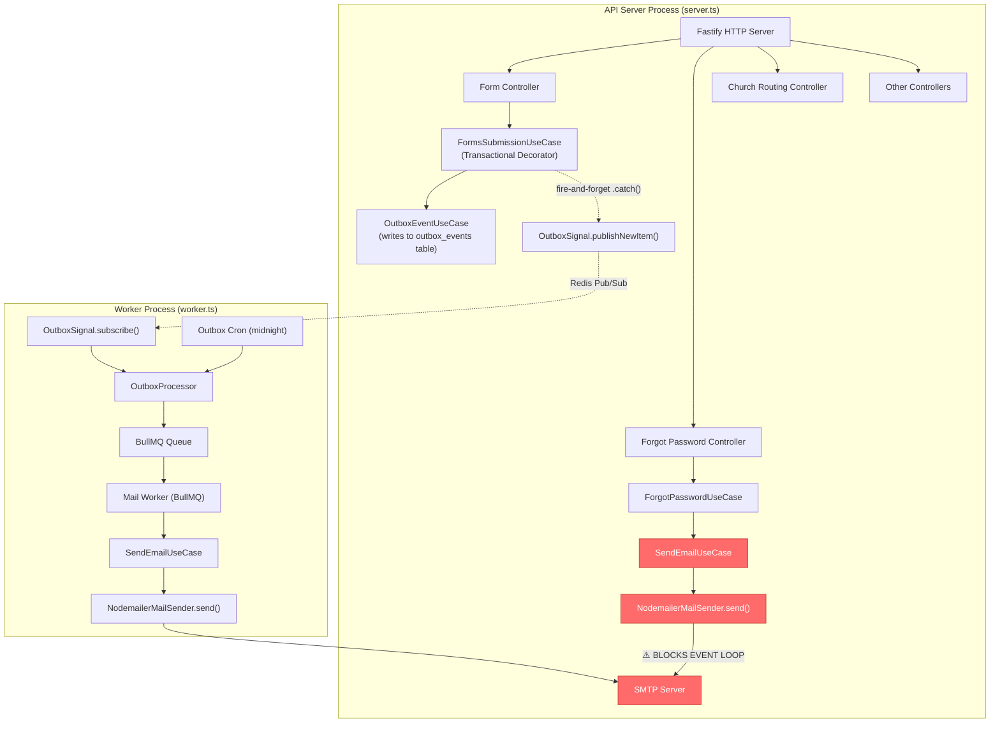
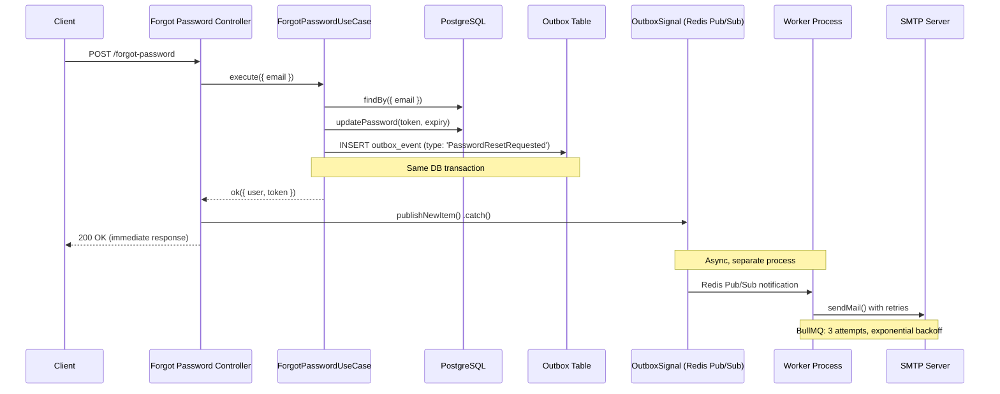
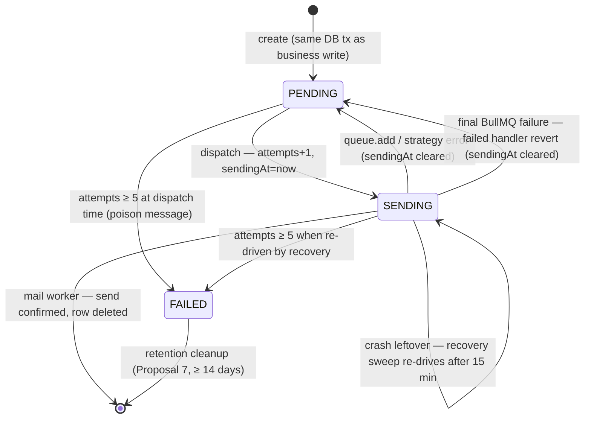
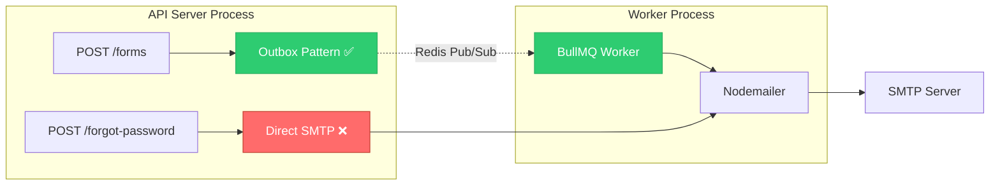
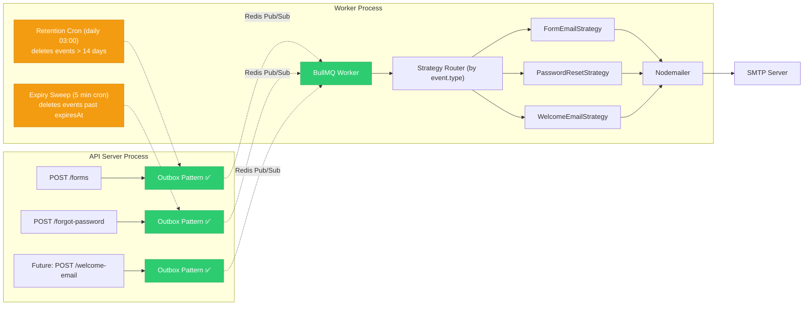
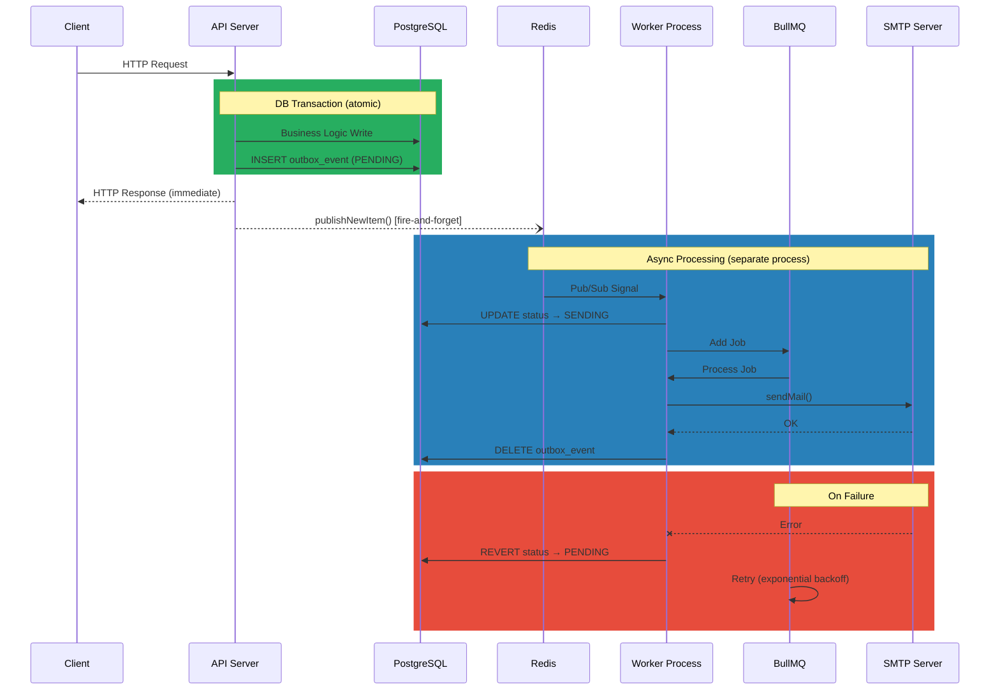

# Email Dispatch System — Architecture Analysis & Resilience Audit

> **Scope**: Full analysis of all email-sending paths in the EvangelismoDigital monolith.  
> **Date**: July 2026  
> **Codebase**: `EvangelismoDigitalBackend` (Fastify + Node.js 20 + BullMQ + Nodemailer)  
> **Rev 2 (2026-07-19)**: Deep audit of the outbox PENDING/SENDING state machine. Adds findings **F-10–F-13** (duplicate-send on delete failure, rows orphaned in `SENDING`, poison-message loop, state-machine hygiene) — **all four fixed in code** (see §5). Amends Proposal 2 with an **expiration-aware** password-reset design, and adds **Proposal 7** (2-week outbox retention) and **Proposal 8** (stricter password-reset cleanup).

---

## Table of Contents

1. [Executive Summary](#1-executive-summary)
2. [Architecture Overview](#2-architecture-overview)
3. [Path-by-Path Analysis](#3-path-by-path-analysis)
   - 3.1 [Forms Submission Pipeline (Outbox + Worker)](#31-forms-submission-pipeline-outbox--worker)
   - 3.2 [Forgot-Password Pipeline (Synchronous)](#32-forgot-password-pipeline-synchronous)
4. [Risk Severity Matrix](#4-risk-severity-matrix)
5. [Detailed Findings](#5-detailed-findings)
6. [Refactoring Proposals](#6-refactoring-proposals)
7. [Implementation Priority Order](#7-implementation-priority-order)
8. [Appendix — Architectural Diagrams](#8-appendix--architectural-diagrams)

---

## 1. Executive Summary

The monolith employs **two fundamentally different architectures** for dispatching emails:

| Flow | Architecture | Async? | Event-Loop Safe? | SMTP Failure Resilient? |
|------|-------------|--------|-------------------|------------------------|
| **Forms Submission** | Outbox Pattern → Redis Pub/Sub → BullMQ Worker (separate process) | ✅ **Yes** | ✅ **Yes** | ✅ **Yes** (retry + idempotency) |
| **Forgot Password** | Direct `SendEmailUseCase.execute()` inside HTTP handler | ❌ **No** | ⚠️ **Partially** | ❌ **No** (single attempt, no timeout) |

> [!IMPORTANT]
> **The forms submission pipeline is architecturally sound** — but the Rev 2 state-machine audit found four implementation defects inside it (F-10–F-13, §5): a duplicate-email path, rows silently orphaned in `SENDING` for up to 24 h, no terminal state for poison messages, and a stuck-recovery threshold shorter than a job's real lifetime. **All four are fixed in code as of Rev 2.** The remaining architectural vulnerability is the **forgot-password flow**, which calls `nodemailer.sendMail()` synchronously within the Fastify request lifecycle. An SMTP server that hangs (TCP timeout defaults to 120s+ on most OS) will **block the HTTP response for 2+ minutes**, consuming a Fastify connection slot and degrading the event loop for all concurrent requests — including church routing.

---

## 2. Architecture Overview

The application is deployed as **two separate Node.js processes** from the same codebase:

| Process | Entrypoint | Responsibility |
|---------|-----------|----------------|
| **API Server** | [server.ts](file:///home/amaro/EvangelismoDigitalBackend/src/server.ts) | HTTP requests (Fastify), form submissions, auth, church routing |
| **Background Worker** | [worker.ts](file:///home/amaro/EvangelismoDigitalBackend/src/worker.ts) | BullMQ job processing, outbox cron, SMTP dispatch |

Both processes share the same Docker image ([Dockerfile](file:///home/amaro/EvangelismoDigitalBackend/Dockerfile) L75-76: `CMD ["node", "dist/server.js"]`, overridden with `node dist/worker.js` for the worker).



---

## 3. Path-by-Path Analysis

### 3.1 Forms Submission Pipeline (Outbox + Worker)

**Verdict: ✅ Well-architected, async, and resilient** *(Rev 2: four implementation defects — F-10–F-13 — were found in the state machine and fixed; see §5).*

#### Data Flow

1. **HTTP Request** → [form.controller.ts](file:///home/amaro/EvangelismoDigitalBackend/src/http/controllers/forms/form.controller.ts)
2. **Transactional Use Case** → [make-form-submission-use-case.ts](file:///home/amaro/EvangelismoDigitalBackend/src/use-cases/forms/factories/make-form-submission-use-case.ts) wraps in [TransactionalUseCaseDecorator](file:///home/amaro/EvangelismoDigitalBackend/src/use-cases/decorators/transactional-use-case.decorator.ts)
3. **Within the DB transaction**:
   - [FormsSubmissionUseCase](file:///home/amaro/EvangelismoDigitalBackend/src/use-cases/forms/forms-submission.ts) persists the form record
   - [OutboxEventUseCase](file:///home/amaro/EvangelismoDigitalBackend/src/use-cases/outbox-event/outbox-event-use-case.ts) writes a `PENDING` event to the `outbox_events` table **in the same transaction**
4. **After commit** (controller L30-35): [OutboxSignal.publishNewItem()](file:///home/amaro/EvangelismoDigitalBackend/src/lib/infra/events/outbox-signal.ts#L78-L86) fires a Redis Pub/Sub signal with **fire-and-forget semantics** (`.catch()` swallows errors)
5. **Worker process** receives signal → [OutboxProcessor.processSingleEvent()](file:///home/amaro/EvangelismoDigitalBackend/src/lib/infra/jobs/outbox-processor.ts#L94-L115) transitions to `SENDING` → dispatches to BullMQ
6. **BullMQ Worker** → [mail-worker.ts](file:///home/amaro/EvangelismoDigitalBackend/src/lib/workers/mail-worker.ts) picks up the job, sends via Nodemailer, deletes the outbox event

#### Strengths

| Feature | Implementation | File |
|---------|---------------|------|
| **Transactional Outbox** | Form + outbox event in same DB transaction | [transactional-use-case.decorator.ts](file:///home/amaro/EvangelismoDigitalBackend/src/use-cases/decorators/transactional-use-case.decorator.ts) |
| **Process Isolation** | Worker runs as a separate `node dist/worker.js` process | [worker.ts](file:///home/amaro/EvangelismoDigitalBackend/src/worker.ts), [Dockerfile](file:///home/amaro/EvangelismoDigitalBackend/Dockerfile#L76) |
| **Fire-and-forget signal** | Redis Pub/Sub failure doesn't block the HTTP response | [form.controller.ts](file:///home/amaro/EvangelismoDigitalBackend/src/http/controllers/forms/form.controller.ts#L30-L35) |
| **Durable fallback** | Midnight cron sweeps `PENDING` events if signal was missed | [outbox-cron.ts](file:///home/amaro/EvangelismoDigitalBackend/src/lib/infra/jobs/outbox-cron.ts) |
| **Retry with backoff** | BullMQ: 3 attempts, exponential backoff starting at 10s | [mail-queue.ts](file:///home/amaro/EvangelismoDigitalBackend/src/lib/queue/mail-queue.ts#L19-L24) |
| **Idempotency** | Redis NX key prevents duplicate processing | [mail-worker.ts](file:///home/amaro/EvangelismoDigitalBackend/src/lib/workers/mail-worker.ts#L28-L53) |
| **Stuck event recovery** | Recovers events stuck in `SENDING` for > 15 min (raised from 30s in Rev 2 — see F-13) | [outbox-processor.ts](file:///home/amaro/EvangelismoDigitalBackend/src/lib/infra/jobs/outbox-processor.ts#L60-L92) |
| **Terminal FAILED state** *(Rev 2)* | Events exceeding `MAX_DISPATCH_ATTEMPTS` (5 dispatch cycles) become `FAILED` instead of looping forever | [outbox-processor.ts](file:///home/amaro/EvangelismoDigitalBackend/src/lib/infra/jobs/outbox-processor.ts), [outbox.ts](file:///home/amaro/EvangelismoDigitalBackend/src/messages/constants/outbox/outbox.ts) |
| **Final-failure revert** *(Rev 2)* | When BullMQ exhausts all attempts, the `failed` handler reverts the row to `PENDING` for the next cycle | [mail-worker.ts](file:///home/amaro/EvangelismoDigitalBackend/src/lib/workers/mail-worker.ts) |
| **Distributed locking** | Lua-based Redis locks prevent concurrent processing | [distributed-lock.ts](file:///home/amaro/EvangelismoDigitalBackend/src/lib/infra/distributed-lock/distributed-lock.ts) |
| **Graceful shutdown** | Worker closes BullMQ, disconnects Pub/Sub, flushes Sentry | [worker.ts](file:///home/amaro/EvangelismoDigitalBackend/src/worker.ts#L74-L98) |

#### Concerns (Minor)

| Issue | Severity | Detail |
|-------|----------|--------|
| **No SMTP connection timeout** | Medium | `NodemailerMailSender` doesn't set `connectionTimeout` or `greetingTimeout` — a hanging SMTP server can stall the BullMQ worker thread for the OS TCP timeout (~120s), but this only blocks the worker, **not the API server** | 
| **`Promise.all` for batch emails** | Low | [mail-worker.ts L59](file:///home/amaro/EvangelismoDigitalBackend/src/lib/workers/mail-worker.ts#L59): All emails in a batch are sent concurrently. If one fails, `Promise.all` still waits for all to settle but only the first error is thrown. Partial-send state is possible (user email sent but staff email failed) |
| **Transporter caching across verify failures** | Low | [nodemailer-mail-sender.ts L24-29](file:///home/amaro/EvangelismoDigitalBackend/src/lib/mail/nodemailer-mail-sender.ts#L24-L29): If `verify()` fails, the transporter is **not** cached (correct), but a flapping SMTP server will trigger `createTransport()` on every retry, creating connection overhead |
| **Cron only runs at midnight** | Low | If the worker restarts at 00:01, stale `PENDING` events won't be processed until the next midnight. The real-time Pub/Sub signal mitigates this in happy-path scenarios |

> [!NOTE]
> **Rev 2**: the state-machine audit promoted several of these concerns into concrete findings **F-10–F-13** (see §4/§5), all of which have been fixed in code. The table above is kept for historical context.

---

### 3.2 Forgot-Password Pipeline (Synchronous)

**Verdict: ❌ Synchronous, blocks event loop, no retry, no timeout.**

#### Data Flow

1. **HTTP Request** → [forgot-password.controller.ts](file:///home/amaro/EvangelismoDigitalBackend/src/http/controllers/users/forgot-password.controller.ts)
2. **Use Case** → [ForgotPasswordUseCase](file:///home/amaro/EvangelismoDigitalBackend/src/use-cases/users/forgot-password.ts)
3. **Within the same request**: Generates token → updates DB → **directly calls** `sendEmailUseCase.execute()` (L68-73)
4. `SendEmailUseCase` → `NodemailerMailSender.send()` → **blocks on `transporter.sendMail()` until SMTP responds**
5. If email fails: token is invalidated in the DB (L77-80) and the user gets a `FailedToSendEmailError`

#### Critical Problems

##### 🔴 Problem 1: No SMTP Timeout Configuration

[nodemailer-mail-sender.ts](file:///home/amaro/EvangelismoDigitalBackend/src/lib/mail/nodemailer-mail-sender.ts#L14-L22) creates the transporter with **no timeout settings**:

```typescript
const transporter = nodemailer.createTransport({
  host: env.SMTP_HOST,
  port: env.SMTP_PORT,
  secure: env.SMTP_SECURE,
  auth: {
    user: env.SMTP_EMAIL,
    pass: env.SMTP_PASSWORD,
  },
})
```

Nodemailer defaults:
- `connectionTimeout`: **120,000ms (2 minutes)**
- `greetingTimeout`: **30,000ms**
- `socketTimeout`: **600,000ms (10 minutes!)**

If the SMTP server is unreachable (firewall, DNS failure), the HTTP request **hangs for up to 2+ minutes** before `sendMail()` rejects. During this time, the Fastify event loop is degraded for **all concurrent requests** (church routing, form submissions, auth).

##### 🔴 Problem 2: Event-Loop Contention

While Node.js I/O is non-blocking, a **pending** SMTP connection keeps the request handler's async context alive, consuming:
- A Fastify connection slot
- Memory for the request/response lifecycle
- Potential cascading delays if multiple forgot-password requests arrive during an SMTP outage

With no `connectionTimeout`, multiple concurrent forgot-password requests during an SMTP outage could accumulate and exhaust Fastify's connection pool.

##### 🔴 Problem 3: No Retry Mechanism

Unlike the forms pipeline (BullMQ: 3 attempts, exponential backoff), the forgot-password flow has **zero retry logic**:
- [forgot-password.ts L68-82](file:///home/amaro/EvangelismoDigitalBackend/src/use-cases/users/forgot-password.ts#L68-L82): If `sendMail()` fails, the token is immediately invalidated and the user must re-request
- Transient SMTP errors (network blip, rate limit) become permanent failures for the user

##### 🟡 Problem 4: Shared Transporter Instance Across Processes

[make-send-email-use-case.ts](file:///home/amaro/EvangelismoDigitalBackend/src/use-cases/factories/make-send-email-use-case.ts#L7) creates a **module-level singleton**:

```typescript
const mailSender = new NodemailerMailSender()
```

This module is imported by both:
- The **worker process** (via `mail-worker.ts`)  
- The **API server process** (via `make-forgot-password-use-case.ts`)

Since these are separate Node.js processes, each gets its own instance — no runtime sharing. However, the same `NodemailerMailSender` class is used in both contexts, meaning the transporter caching behavior (the `this.transporter` field) applies identically. A failed `verify()` in the API server's transporter would correctly leave it un-cached, triggering re-creation on the next forgot-password request. **This is architecturally correct but conceptually confusing** — the singleton comment implies reuse across jobs, but it's actually reuse across requests within the same process.

##### 🟡 Problem 5: Token Invalidation Race Condition

[forgot-password.ts L77-80](file:///home/amaro/EvangelismoDigitalBackend/src/use-cases/users/forgot-password.ts#L77-L80): If the email fails, the token is invalidated:

```typescript
await this.usersRepository.updatePassword(user.publicId, {
  token: null,
  tokenExpiresAt: null,
})
```

However, if this secondary DB call **also** fails (network error), the token remains valid in the database but the user was told the operation failed. There's no error handling on this cleanup call — it's a fire-and-forget `await` with no `try/catch`.

---

## 4. Risk Severity Matrix

| # | Finding | Severity | Impact | Likelihood | Affected Path |
|---|---------|----------|--------|------------|---------------|
| F-1 | **No SMTP timeout in NodemailerMailSender** | 🔴 **Critical** | SMTP hang blocks event loop for 2+ min, degrading all API endpoints including church routing | Medium (depends on SMTP reliability) | Forgot-Password (direct), Worker (indirect) |
| F-2 | **Forgot-password sends email synchronously in HTTP request** | 🔴 **Critical** | Slow SMTP directly increases p99 latency for forgot-password; cascading connection exhaustion under SMTP outage | Medium | Forgot-Password |
| F-3 | **No retry mechanism for forgot-password emails** | 🟠 **High** | Transient SMTP failures permanently fail the user's password reset attempt | High (transient errors are common) | Forgot-Password |
| F-4 | **Token invalidation has no error handling** | 🟡 **Medium** | DB failure during cleanup leaves orphaned tokens; minor security concern (tokens expire in 15 min) | Low | Forgot-Password |
| F-5 | **`Promise.all` partial-send in worker batch** | 🟡 **Medium** | User might receive email but staff doesn't (or vice versa); idempotency key set to 'completed' regardless | Low | Forms Pipeline (Worker) |
| F-6 | **Worker SMTP hang blocks BullMQ concurrency slot** | 🟡 **Medium** | Without SMTP timeout, a worker concurrency slot (of 5) can be blocked for 2+ min | Medium | Forms Pipeline (Worker) |
| F-7 | **Transporter re-creation overhead during SMTP flapping** | 🟢 **Low** | Repeated `createTransport()` + `verify()` calls during SMTP instability; minimal resource impact | Low | Both |
| F-8 | **Outbox cron only at midnight** | 🟢 **Low** | Events missed by Pub/Sub wait up to 24h; mitigated by real-time signal in happy path | Very Low | Forms Pipeline |
| F-9 | **Horizontal scaling cron contention** (already documented) | 🟢 **Low** | Multiple workers compete for the cron lock; documented in [worker.ts L46-57](file:///home/amaro/EvangelismoDigitalBackend/src/worker.ts#L46-L57) with leader election suggestion. The Pub/Sub handler shares the same caveat: Redis delivers the signal to **all** subscribers, so N pods would process the same event concurrently, protected only by the deterministic BullMQ `jobId` and the idempotent `updateStatus` | Low (current single-worker setup) | Forms Pipeline |
| F-10 | **Idempotency `completed` marker deleted on outbox-delete failure → duplicate emails** — ✅ *fixed (Rev 2)* | 🔴 **Critical** | After a successful send, a failing outbox `delete` wiped the `completed` key, so the BullMQ retry re-sent the same emails (up to 3×) | Low frequency, high impact (needs a DB blip exactly between send and delete) | Forms Pipeline (Worker) |
| F-11 | **Rows orphaned in `SENDING` after final BullMQ failure** — ✅ *fixed (Rev 2)* | 🟠 **High** | The `failed` handler only logged; with `removeOnFail: true` the outbox row stayed `SENDING`, invisible for up to 24 h until the midnight sweep | High (any email failing 3 straight times) | Forms Pipeline (Worker) |
| F-12 | **No terminal state / attempt counter → poison-message loop** — ✅ *fixed (Rev 2)* | 🟠 **High** | A permanently failing event (e.g. malformed payload) was re-dispatched by every midnight sweep forever, and the row never left the table | Medium | Forms Pipeline |
| F-13 | **State-machine hygiene**: 30 s stuck threshold < real job lifetime; unbounded `findStuck`; P2025 delete burned retries; stale `sendingAt` on revert — ✅ *fixed (Rev 2)* | 🟡 **Medium** | Latent duplicate-dispatch if the sweep ever ran more often than daily; noisy no-op retries; unreliable `sendingAt` field | Medium | Forms Pipeline |

---

## 5. Detailed Findings

### Finding F-1: Missing SMTP Timeouts (Critical)

**File**: [nodemailer-mail-sender.ts](file:///home/amaro/EvangelismoDigitalBackend/src/lib/mail/nodemailer-mail-sender.ts#L14-L22)

The Nodemailer transport is created without any timeout configuration:

```diff
 const transporter = nodemailer.createTransport({
   host: env.SMTP_HOST,
   port: env.SMTP_PORT,
   secure: env.SMTP_SECURE,
   auth: {
     user: env.SMTP_EMAIL,
     pass: env.SMTP_PASSWORD,
   },
+  connectionTimeout: 5_000,    // 5s to establish TCP connection
+  greetingTimeout: 5_000,      // 5s for SMTP greeting
+  socketTimeout: 10_000,       // 10s for socket inactivity
 })
```

**Why it matters**: Without these, Nodemailer falls back to OS-level TCP timeouts:
- **Linux `tcp_syn_retries`**: Defaults to 6 retries with exponential backoff ≈ **~127 seconds**
- **Nodemailer `socketTimeout`** default: **600,000ms (10 minutes)**

This means a single `sendMail()` call to an unresponsive SMTP server can hang for **2-10 minutes**.

**Impact on the API server**: The forgot-password handler `await`s this call directly. During the hang, Fastify's event loop continues to process other microtasks, but:
- The HTTP connection slot remains occupied
- Under concurrent forgot-password requests, connection slots accumulate
- Fastify's default `connectionTimeout` is 72 seconds, but the request is already being processed — the socket won't be freed

### Finding F-2: Synchronous Email in HTTP Request Lifecycle (Critical)

**Files**: 
- [forgot-password.controller.ts](file:///home/amaro/EvangelismoDigitalBackend/src/http/controllers/users/forgot-password.controller.ts#L17) — `await forgotPasswordUseCase.execute()`
- [forgot-password.ts](file:///home/amaro/EvangelismoDigitalBackend/src/use-cases/users/forgot-password.ts#L68-L73) — `await this.sendEmailUseCase.execute()`

The full call chain within a single HTTP request:

```
HTTP POST /forgot-password
  → forgotPasswordUseCase.execute()
    → usersRepository.findBy()          // DB query (~5ms)
    → usersRepository.updatePassword()   // DB write (~10ms)
    → sendEmailUseCase.execute()         // ⚠️ SMTP call (50ms–600,000ms)
      → NodemailerMailSender.send()
        → transporter.verify()           // Only on first call
        → transporter.sendMail()         // BLOCKS until SMTP responds
```

**Contrast with forms pipeline**: The form controller at [form.controller.ts L30](file:///home/amaro/EvangelismoDigitalBackend/src/http/controllers/forms/form.controller.ts#L30) uses fire-and-forget:

```typescript
OutboxSignal.publishNewItem(outboxEvent.publicId, outboxEvent).catch(() => {
  logger.error(...)
})
```

The HTTP response is returned **immediately** after the DB transaction commits. Email dispatch happens in a completely separate process.

### Finding F-3: No Retry for Forgot-Password (High)

**File**: [forgot-password.ts L68-82](file:///home/amaro/EvangelismoDigitalBackend/src/use-cases/users/forgot-password.ts#L68-L82)

```typescript
const emailResult = await this.sendEmailUseCase.execute({...})

if (isErr(emailResult)) {
  // Immediately invalidate token — no retry
  await this.usersRepository.updatePassword(user.publicId, {
    token: null,
    tokenExpiresAt: null,
  })
  return err(new FailedToSendEmailError())
}
```

**Comparison**: The BullMQ mail queue has:
- **3 retry attempts** ([mail-queue.ts L20](file:///home/amaro/EvangelismoDigitalBackend/src/lib/queue/mail-queue.ts#L20))
- **Exponential backoff** starting at 10s ([mail-queue.ts L21-23](file:///home/amaro/EvangelismoDigitalBackend/src/lib/queue/mail-queue.ts#L21-L23))
- **Idempotency protection** ([mail-worker.ts L28-53](file:///home/amaro/EvangelismoDigitalBackend/src/lib/workers/mail-worker.ts#L28-L53))

The forgot-password flow has **none of these protections**.

### Finding F-5: `Promise.all` Partial-Send (Medium)

**File**: [mail-worker.ts L59](file:///home/amaro/EvangelismoDigitalBackend/src/lib/workers/mail-worker.ts#L59)

```typescript
const results = await Promise.all(emails.map((email) => sendEmailUseCase.execute(email)))
```

If a batch contains 2 emails (user + staff) and the user email succeeds but the staff email fails:
1. `Promise.all` resolves all promises (since `execute()` returns `Result`, not throwing)
2. The `failedResult` check (L61-64) finds the failed one and throws
3. The idempotency key is deleted (L79), allowing retry
4. On retry, **the user email is sent again** (duplicate)

This isn't critical because:
- BullMQ only retries 3 times
- Duplicate notification emails are a nuisance, not a data integrity issue
- The idempotency key deletion on failure is the correct behavior for retry

But it could be improved with `Promise.allSettled` and per-email tracking.

### Finding F-10: Idempotency Marker Destroyed on Delete Failure → Duplicate Emails (Critical) — ✅ Fixed

**File**: [mail-worker.ts](file:///home/amaro/EvangelismoDigitalBackend/src/lib/workers/mail-worker.ts)

The original job processor used a single `try/catch` around **both** the email-send phase and the outbox-row cleanup. The failure sequence was:

1. All emails sent successfully.
2. Idempotency key set to `'completed'` (24 h TTL).
3. `outboxRepository.delete(publicId)` fails (transient DB error).
4. The `catch` ran `redisCache.del(idempotencyKey)` — **wiping the `'completed'` marker**.
5. BullMQ retried the job; `SET NX` succeeded (key gone) → **the same emails were sent again**, up to 3× if the delete kept failing, after which the row was also stranded in `SENDING` (F-11).

The idempotency guard was destroyed on exactly the path it existed to protect.

**Fix (Rev 2)**: the processor is now split into two phases. The `catch` that deletes the idempotency key covers **only** the send phase (where the key still holds `'processing'`). If the outbox delete fails after `'completed'` was written, the error is rethrown **without touching the key** — the BullMQ retry then lands in the `status === 'completed'` dedup branch and only re-attempts the row deletion. Regression-tested end-to-end in [mail-worker.spec.ts](file:///home/amaro/EvangelismoDigitalBackend/src/lib/workers/mail-worker.spec.ts) ("regressão do envio duplicado").

### Finding F-11: Rows Orphaned in `SENDING` After Final BullMQ Failure (High) — ✅ Fixed

**File**: [mail-worker.ts](file:///home/amaro/EvangelismoDigitalBackend/src/lib/workers/mail-worker.ts)

When a job exhausted its 3 BullMQ attempts, the `worker.on('failed')` handler **only logged**. With `removeOnFail: true` the job vanished from Redis, and the outbox row stayed in `SENDING` — invisible to `findPending` — until the **midnight-only** recovery sweep. A form email failing at 00:05 would not be retried for ~24 hours, with no observable signal.

**Fix (Rev 2)**: a new `createJobFailureHandler` detects finality (`job.attemptsMade >= job.opts.attempts`, and treats `"job stalled more than allowable limit"` as final) and reverts the row to `PENDING` (clearing `sendingAt`), making it immediately eligible for the next processing cycle. The revert deliberately goes to `PENDING`, not `FAILED` — the terminal transition is owned solely by the processor's attempts-cap guard (F-12). The handler swallows and logs its own errors so a rejection can never bubble into `unhandledRejection` → `crashShutdown`.

### Finding F-12: No Terminal State — Poison-Message Loop (High) — ✅ Fixed

**Files**: [schema.prisma](file:///home/amaro/EvangelismoDigitalBackend/prisma/schema.prisma), [outbox-processor.ts](file:///home/amaro/EvangelismoDigitalBackend/src/lib/infra/jobs/outbox-processor.ts)

The status enum had only `PENDING` and `SENDING`, and there was no attempt counter. A permanently failing event (malformed payload, invalid recipient) was re-driven by every midnight sweep **forever**, and its row never left the table.

**Fix (Rev 2)** — migration `add_outbox_failed_status_and_attempts`:

- `outbox_events.attempts INTEGER NOT NULL DEFAULT 0` — incremented on every `PENDING → SENDING` transition (i.e., per **dispatch cycle**, not per BullMQ attempt; BullMQ already retries 3× internally within one cycle).
- New enum value `FAILED` (terminal). `processSingleEvent` short-circuits any event with `attempts >= MAX_DISPATCH_ATTEMPTS` (5) into `FAILED` before dispatching.

The resulting state machine:

```
PENDING --(dispatch: attempts+1, sendingAt=now)--> SENDING
SENDING --(mail worker: send confirmed)----------> row deleted ("sent")
SENDING --(queue.add / strategy error)-----------> PENDING (sendingAt cleared)
SENDING --(final BullMQ job failure)-------------> PENDING (sendingAt cleared)
SENDING --(crash; sendingAt > 15 min)------------> re-driven by recovery sweep
any     --(attempts >= 5 at dispatch time)-------> FAILED (terminal)
```

Worst case for a poison message: 5 dispatch cycles × 3 BullMQ attempts = 15 sends attempted, then permanent `FAILED`. `FAILED` rows stay in the table for inspection and are the primary target of the retention cleanup (Proposal 7).

### Finding F-13: State-Machine Hygiene (Medium) — ✅ Fixed

Grouped smaller defects, all fixed in Rev 2:

| Defect | Problem | Fix |
|--------|---------|-----|
| `STUCK_SENDING_MS = 30s` | A healthy job legitimately stays `SENDING` for its whole BullMQ lifetime (3 attempts × up to 300 s lock + backoff). A 30 s threshold classified live jobs as "stuck" — a latent duplicate-dispatch bug the moment the sweep runs more often than daily | Raised to **15 min** ([outbox.ts](file:///home/amaro/EvangelismoDigitalBackend/src/messages/constants/outbox/outbox.ts)), above worst-case job lifetime. Recovery is now purely a crash-leftover net (the F-11 handler reverts prompt failures) |
| Unbounded `findStuck` | After an outage stranding many rows, the sweep loaded them all at once | `findStuck(stuckBefore, limit)` with `STUCK_FETCH_LIMIT = 50`, mirroring `findPending` |
| P2025 delete burned retries | Deleting an already-deleted row threw → InfraError → BullMQ retried the no-op delete 3× with error logs | Repository `delete` treats P2025 as success (idempotent delete) ([prisma-outbox-event-repository.ts](file:///home/amaro/EvangelismoDigitalBackend/src/repositories/prisma/prisma-outbox-event-repository.ts)) |
| Stale `sendingAt` on revert | Reverting `SENDING → PENDING` left the old `sendingAt` populated, making the field unreliable | `updateStatus` now clears `sendingAt` on any transition away from `SENDING` |

**Test coverage (Rev 2)**: the state machine is now covered by ~70 unit tests across [outbox-processor.spec.ts](file:///home/amaro/EvangelismoDigitalBackend/src/lib/infra/jobs/outbox-processor.spec.ts), [mail-worker.spec.ts](file:///home/amaro/EvangelismoDigitalBackend/src/lib/workers/mail-worker.spec.ts), [in-memory-outbox-repository.spec.ts](file:///home/amaro/EvangelismoDigitalBackend/src/repositories/in-memory/in-memory-outbox-repository.spec.ts) and [prisma-outbox-event-repository.spec.ts](file:///home/amaro/EvangelismoDigitalBackend/src/repositories/prisma/prisma-outbox-event-repository.spec.ts) (new `unit-repositories` vitest project), including regressions for every F-10–F-13 scenario.

---

## 6. Refactoring Proposals

### Proposal 1: Add SMTP Timeouts (Immediate Fix — Addresses F-1, F-6)

> [!IMPORTANT]
> This is the **highest-impact, lowest-effort** fix. It should be deployed immediately.

**File to modify**: [nodemailer-mail-sender.ts](file:///home/amaro/EvangelismoDigitalBackend/src/lib/mail/nodemailer-mail-sender.ts)

```diff
 const transporter = nodemailer.createTransport({
   host: env.SMTP_HOST,
   port: env.SMTP_PORT,
   secure: env.SMTP_SECURE,
   auth: {
     user: env.SMTP_EMAIL,
     pass: env.SMTP_PASSWORD,
   },
+  // Defensive timeouts: prevent SMTP hangs from blocking the caller
+  connectionTimeout: 5_000,    // 5s to establish TCP connection
+  greetingTimeout: 5_000,      // 5s for SMTP server greeting (220 response)
+  socketTimeout: 10_000,       // 10s max inactivity per socket operation
 })
```

**Also add to `verify()`**: The `verify()` call at L25 uses the same transporter, so timeouts apply automatically. No additional changes needed.

**Effort**: ~5 minutes. Zero risk of side effects.

**Optionally, make configurable via env**:

```typescript
// In env/index.ts
SMTP_CONNECTION_TIMEOUT: z.coerce.number().default(5_000),
SMTP_GREETING_TIMEOUT: z.coerce.number().default(5_000),
SMTP_SOCKET_TIMEOUT: z.coerce.number().default(10_000),
```

---

### Proposal 2: Route Forgot-Password Through the Outbox Pattern (Addresses F-2, F-3)

> [!IMPORTANT]
> This is the most architecturally impactful change. It eliminates the synchronous email path entirely.

#### Design

Reuse the existing **Outbox Pattern + BullMQ** infrastructure to handle forgot-password emails:



#### Changes Required

##### 1. Extend the Outbox Event Types

**File**: `core/contracts/repository/outbox-repository.interface.ts`

Add a new event type:

```typescript
export type OutboxEventType = 'FormSubmissionCreated' | 'PasswordResetRequested'
```

##### 2. Create a Password-Reset Email Strategy

**New file**: `src/use-cases/users/strategies/password-reset-email-strategy.ts`

Following the same pattern as [DecisionForChristEmailStrategy](file:///home/amaro/EvangelismoDigitalBackend/src/use-cases/forms/strategies/decision-for-christ-email-strategy.ts):

```typescript
export class PasswordResetEmailStrategy implements IFormEmailStrategy {
  buildUserEmail(payload: PasswordResetPayload): Result<IMailJobData, AppError> {
    return ok({
      to: payload.email,
      subject: EMAIL_CONSTANTS.PASSWORD_RECOVERY_SUBJECT,
      message: forgotPasswordTextTemplate(payload.name, payload.token),
      html: forgotPasswordHtmlTemplate(payload.name, payload.token),
      context: { type: 'password-reset', recipient: 'user' },
    })
  }

  // No staff email needed for password reset
  buildStaffEmail(): Result<IMailJobData, AppError> {
    return ok(null) // Or a no-op
  }
}
```

##### 3. Refactor ForgotPasswordUseCase

**File**: [forgot-password.ts](file:///home/amaro/EvangelismoDigitalBackend/src/use-cases/users/forgot-password.ts)

Remove the direct `sendEmailUseCase.execute()` call. Instead, write an outbox event:

```typescript
export class ForgotPasswordUseCase {
  constructor(
    private usersRepository: UsersRepository,
    private eventRegistration: IOutboxEventRegistration, // Replace SendEmailUseCase
  ) {}

  async execute({ email }: ForgotPasswordUseCaseRequest) {
    // ... existing user lookup and token generation ...
    
    // Instead of sending email directly:
    const outboxEvent = await this.eventRegistration.register({
      type: 'PasswordResetRequested',
      email: user.email,
      name: user.name,
      token: passwordToken,
    })
    
    if (isErr(outboxEvent)) {
      return outboxEvent
    }

    return ok({ user, token: passwordToken })
  }
}
```

##### 4. Update the OutboxProcessor dispatcher

**File**: [outbox-processor.ts](file:///home/amaro/EvangelismoDigitalBackend/src/lib/infra/jobs/outbox-processor.ts#L117-L140)

Add routing for the new event type in `dispatchToBullMQ`:

```typescript
private async dispatchToBullMQ(event: IOutboxEvent): Promise<void> {
  const strategy = this.resolveStrategy(event)
  // ... existing dispatch logic ...
}

private resolveStrategy(event: IOutboxEvent): IFormEmailStrategy {
  if (event.type === 'PasswordResetRequested') {
    return new PasswordResetEmailStrategy()
  }
  
  const payload = event.payload as FormPayload
  return payload.decisaoPorCristo 
    ? new DecisionForChristEmailStrategy() 
    : new ContactEmailStrategy()
}
```

##### 5. Wrap ForgotPasswordUseCase in TransactionalDecorator

**File**: [make-forgot-password-use-case.ts](file:///home/amaro/EvangelismoDigitalBackend/src/use-cases/factories/make-forgot-password-use-case.ts)

Follow the same pattern as [make-form-submission-use-case.ts](file:///home/amaro/EvangelismoDigitalBackend/src/use-cases/forms/factories/make-form-submission-use-case.ts):

```typescript
export function makeForgotPasswordUseCase() {
  const dbContext = new DatabaseContext()
  // ... repositories and error mappers ...
  const outboxRepository = new PrismaOutboxRepository(dbContext, httpMapper, infraMapper)
  const eventRegistration = new OutboxEventUseCase(outboxRepository)
  
  const useCase = new ForgotPasswordUseCase(usersRepository, eventRegistration)
  return new TransactionalUseCaseDecorator(useCase, dbContext)
}
```

##### 6. Update the Controller

**File**: [forgot-password.controller.ts](file:///home/amaro/EvangelismoDigitalBackend/src/http/controllers/users/forgot-password.controller.ts)

Add fire-and-forget Pub/Sub signal after the transaction (same pattern as form controller):

```typescript
const { outboxEvent } = result.value

OutboxSignal.publishNewItem(outboxEvent.publicId, outboxEvent).catch(() => {
  logger.error({ publicId: outboxEvent.publicId }, 'Failed to publish password reset signal')
})

return reply.code(200).send({ message: EMAIL_CONSTANTS.PASSWORD_RESET_GENERIC_MESSAGE })
```

#### Impact of Proposal 2

| Aspect | Before | After |
|--------|--------|-------|
| HTTP response time | 50ms–600,000ms (SMTP-dependent) | ~15ms (DB only) |
| SMTP failure impact on API | Blocks event loop | Zero impact (worker handles it) |
| Retry capability | None | 3 attempts, exponential backoff |
| Idempotency | None | Redis NX key |
| Email delivery guarantee | Best-effort single attempt | At-least-once with dedup |

> [!WARNING]  
> **Token-in-Outbox Security Consideration**: The password reset token will now be stored in the `outbox_events` table payload alongside the existing `outbox_events` in PostgreSQL. Since this is the same database, and the token is already stored in the users table, this doesn't introduce a new attack surface. The outbox event is deleted after successful email dispatch. However, ensure the outbox table has equivalent access controls to the users table.

#### Proposal 2 — Amendment (Rev 2): Expiration-Aware Dispatch

The base design above ignores a hard constraint: **the reset token expires 15 minutes after creation** (`EXPIRES_IN_MINUTES = 15`, currently hardcoded in [forgot-password.ts L23](file:///home/amaro/EvangelismoDigitalBackend/src/use-cases/users/forgot-password.ts#L23)). An async pipeline with retries and daily sweeps can otherwise deliver an email **after** the token is dead — the user clicks a fresh-looking link and gets "Token inválido ou expirado", which is worse UX than no email at all. The amended design guarantees a dead link is **never sent**:

##### 1. Schema: `expiresAt` on outbox events

One migration adds a nullable column plus a partial index (raw SQL edit in the generated migration):

```prisma
model OutboxEvent {
  // ...existing fields...
  expiresAt DateTime? @map("expires_at")
}
```

```sql
CREATE INDEX "outbox_events_expires_at_idx" ON "outbox_events" ("expires_at") WHERE "expires_at" IS NOT NULL;
```

A real column (instead of deriving from the JSON payload) makes the expiry sweeps of Proposal 8 a trivial indexed range scan. Form events leave it `NULL` (they never expire).

##### 2. Typed event inputs (discriminated union)

`OutboxEventUseCase.register` currently hardcodes `type: 'FormSubmissionCreated'` and a form-shaped payload. Replace its input with a discriminated union so the compiler enforces per-type payloads:

```typescript
// core/types/outbox/outbox-event-input.ts
export type OutboxEventInput =
  | { type: 'FormSubmissionCreated'; payload: FormPayload; expiresAt?: undefined }
  | {
      type: 'PasswordResetRequested'
      payload: { userPublicId: string; name: string; email: string; token: string; tokenExpiresAt: string }
      expiresAt: Date // = tokenExpiresAt
    }
```

##### 3. Type-based strategy routing

`OutboxProcessor.dispatchToBullMQ` currently never reads `event.type` — it sniffs `payload.decisaoPorCristo`. The amendment makes `event.type` the outer switch (finally using the column):

```typescript
private resolveDispatch(event: IOutboxEvent): { emails: IMailJobData[]; jobOpts: JobsOptions } {
  if (event.type === 'PasswordResetRequested') {
    const strategy = new PasswordResetEmailStrategy() // single user email, no staff email
    // Retry budget must fit inside the 15-min token window:
    // 3 attempts x fixed 30s backoff ≈ ~1 min worst case ≪ 15 min
    return { emails: [/* user */], jobOpts: { jobId: event.publicId, attempts: 3, backoff: { type: 'fixed', delay: 30_000 } } }
  }
  // default: FormSubmissionCreated — existing decisaoPorCristo branch, queue-default job opts
}
```

`IOutboxDispatchData.emails` is already an array, so a single-element batch needs no interface change (the worker spec already covers `emails.length === 1`). Add optional `expiresAt?: string` to `IOutboxDispatchData` for the worker-side check below.

##### 4. Two expiry gates — a dead link is never emailed

1. **Processor gate** ([outbox-processor.ts](file:///home/amaro/EvangelismoDigitalBackend/src/lib/infra/jobs/outbox-processor.ts), before Phase 1): `if (event.expiresAt && event.expiresAt <= new Date())` → `outboxRepository.delete(publicId)`, log, return. Catches events resurrected by the midnight sweep or the F-11 revert path.
2. **Worker gate** ([mail-worker.ts](file:///home/amaro/EvangelismoDigitalBackend/src/lib/workers/mail-worker.ts), before the send phase): same check on `job.data.expiresAt` → delete the outbox row and return **successfully** (no retry, no email). Catches jobs whose backoff delay crossed the expiry boundary while queued.

##### 5. `ForgotPasswordUseCase` refactor — atomicity replaces compensation

- Drop the `SendEmailUseCase` dependency entirely.
- Inside one transaction (`TransactionalUseCaseDecorator`, exactly like [make-form-submission-use-case.ts](file:///home/amaro/EvangelismoDigitalBackend/src/use-cases/forms/factories/make-form-submission-use-case.ts)): write `token`/`tokenExpiresAt` on the user **and** register the `PasswordResetRequested` outbox event with `expiresAt = tokenExpiresAt`.
- The current compensating block (invalidate token when the inline send fails, [forgot-password.ts L75-82](file:///home/amaro/EvangelismoDigitalBackend/src/use-cases/users/forgot-password.ts#L75-L82)) **disappears** — if the transaction commits, delivery is guaranteed-or-expired; if it rolls back, no token exists. This also retires findings F-4 (unhandled cleanup failure) entirely.
- Controller fires `OutboxSignal.publishNewItem` fire-and-forget after commit (same as the form controller) and always returns the generic 200.

##### 6. Template & constants

- Move `EXPIRES_IN_MINUTES` to a shared constant (e.g. `EMAIL_CONSTANTS` or an auth constants module) — it is currently duplicated between the use case and its spec assertions.
- Both templates ([forgot-password-text.ts](file:///home/amaro/EvangelismoDigitalBackend/src/templates/forgot-password/forgot-password-text.ts), [forgot-password-html.ts](file:///home/amaro/EvangelismoDigitalBackend/src/templates/forgot-password/forgot-password-html.ts)) must state the validity window, parametrized from that constant: *"Este link é válido por 15 minutos."* Today they say nothing, so users have no idea the link is short-lived.

##### 7. Security notes

- **Plaintext token**: `users.token` stores the raw 64-hex token (with a unique index), and the amended design also carries it through `outbox_events.payload` (transient — deleted on send or expiry). Recommended follow-up: persist only `sha256(token)` in `users.token` and look up by hash in reset-password; keep the raw token exclusively in the transient outbox payload and the email itself.
- **User enumeration**: [forgot-password.controller.ts](file:///home/amaro/EvangelismoDigitalBackend/src/http/controllers/users/forgot-password.controller.ts) advertises a generic success message but routes `UserNotFoundForPasswordResetError` through `HttpErrorMapper` → **404**, leaking account existence. The controller must treat "user not found" as success (generic 200); only infrastructure errors may surface as 500. Rate limiting (5/hour) already exists but does not remove the oracle.

---

### Proposal 3: Improve `Promise.all` Batch Handling (Addresses F-5)

**File**: [mail-worker.ts L59](file:///home/amaro/EvangelismoDigitalBackend/src/lib/workers/mail-worker.ts#L59)

Replace `Promise.all` with `Promise.allSettled` and individual result tracking:

```typescript
const results = await Promise.allSettled(
  emails.map((email) => sendEmailUseCase.execute(email))
)

const failures = results
  .map((result, index) => ({ result, index }))
  .filter(({ result }) => 
    result.status === 'rejected' || 
    (result.status === 'fulfilled' && isErr(result.value))
  )

if (failures.length > 0) {
  const successCount = emails.length - failures.length
  childLogger.warn(
    { successCount, failureCount: failures.length },
    'Partial batch failure — some emails were sent'
  )
  
  // Throw to trigger BullMQ retry for the entire batch
  const firstFailure = failures[0]
  throw firstFailure.result.status === 'rejected' 
    ? firstFailure.result.reason 
    : (firstFailure.result as PromiseFulfilledResult<any>).value.error
}
```

> [!NOTE]
> A more sophisticated approach would track per-email success/failure in the outbox event payload, allowing selective retry of only failed emails. However, this adds significant complexity for a minor benefit given the current batch size of 2 (user + staff).

---

### Proposal 4: Add Token Invalidation Error Handling (Addresses F-4)

**File**: [forgot-password.ts L77-80](file:///home/amaro/EvangelismoDigitalBackend/src/use-cases/users/forgot-password.ts#L77-L80)

> [!NOTE]
> This proposal becomes unnecessary if Proposal 2 is implemented, since the outbox pattern eliminates the synchronous email call entirely. Include this only if Proposal 2 is deferred.

```diff
 if (isErr(emailResult)) {
-  await this.usersRepository.updatePassword(user.publicId, {
-    token: null,
-    tokenExpiresAt: null,
-  })
+  // Best-effort token cleanup — token expires in 15 min regardless
+  try {
+    await this.usersRepository.updatePassword(user.publicId, {
+      token: null,
+      tokenExpiresAt: null,
+    })
+  } catch (cleanupError) {
+    logger.error(
+      { publicId: user.publicId, err: cleanupError },
+      'Failed to invalidate password reset token after email failure; token will expire naturally'
+    )
+  }
   return err(new FailedToSendEmailError())
 }
```

---

### Proposal 5: Increase Outbox Cron Frequency (Addresses F-8)

**File**: [outbox-cron.ts](file:///home/amaro/EvangelismoDigitalBackend/src/lib/infra/jobs/outbox-cron.ts)

Currently runs once at midnight. Consider adding a more frequent sweep (e.g., every 5 minutes) for `PENDING` events only:

```typescript
// Quick sweep every 5 minutes — processes PENDING events only
cron.schedule('*/5 * * * *', async () => {
  const processor = existingProcessor ?? buildProcessor()
  try {
    await processor.processEvents()
  } catch (error) {
    logger.error({ error }, 'Quick outbox sweep failed')
  }
})

// Full sweep at midnight — recovers STUCK events + processes PENDING
cron.schedule(CRON_SCHEDULES.MIDNIGHT_DAILY, async () => {
  // ... existing midnight logic ...
})
```

> [!NOTE]
> The distributed lock in `processEvents()` already prevents concurrent execution, so increasing frequency is safe. The overhead is minimal (one `SELECT` query per cycle when no events are pending).

---

### Proposal 6: Add Transporter Health Recovery (Addresses F-7)

**File**: [nodemailer-mail-sender.ts](file:///home/amaro/EvangelismoDigitalBackend/src/lib/mail/nodemailer-mail-sender.ts)

Add a mechanism to invalidate a cached transporter after consecutive `sendMail()` failures:

```typescript
export class NodemailerMailSender implements MailSender {
  private transporter: Transporter | null = null
  private consecutiveFailures = 0
  private static readonly MAX_FAILURES_BEFORE_RESET = 3

  async send(request: SendMailRequest): Promise<SentMessageInfo> {
    const transporter = await this.getTransporter()

    try {
      const info = await transporter.sendMail({...})
      this.consecutiveFailures = 0 // Reset on success
      return info
    } catch (error) {
      this.consecutiveFailures++
      
      if (this.consecutiveFailures >= NodemailerMailSender.MAX_FAILURES_BEFORE_RESET) {
        logger.warn('Resetting SMTP transporter after consecutive failures')
        this.transporter = null
        this.consecutiveFailures = 0
      }
      
      throw error
    }
  }
}
```

---

### Proposal 7 (Rev 2): 2-Week Retention Cleanup of `outbox_events`

**Problem**: nothing ever purges the table. Rows only leave via per-event delete on successful send, so `FAILED` rows (Rev 2) and crash debris accumulate indefinitely.

**Policy**: delete **every event older than 14 days, regardless of status**. Rationale per status:
- `FAILED` — terminal by definition; kept 14 days for inspection, then noise.
- `PENDING` ≥ 14 days — survived ≥ 14 daily sweep cycles without being dispatched; with the F-12 attempts cap it would have become `FAILED` long before, so such a row is unreachable debris.
- `SENDING` ≥ 14 days — crash leftovers far beyond the 15-min stuck threshold; the recovery sweep either already re-drove them into the attempts cap or the row is orphaned.

Log a `groupBy status` breakdown at `warn` level whenever `PENDING`/`SENDING` rows are being erased, for observability.

**Repository addition** (Result-wrapped, like every other method):

```typescript
/** Remove eventos mais antigos que a data de corte. Retorna a quantidade removida. */
deleteOlderThan(cutoff: Date, batchSize: number): Promise<Result<number, AppError>>
```

Prisma implementation must be **batched** (Prisma's `deleteMany` has no `take`): loop `findMany({ where: { occurredAt: { lt: cutoff } }, select: { id: true }, take: batchSize })` → `deleteMany({ where: { id: { in: ids } } })` until fewer than `batchSize` rows return, accumulating the count. Batching keeps lock time and WAL churn bounded on a grown table.

**Scheduling**: a second cron in the worker (sibling of `startOutboxCron`), `'0 0 3 * * *'` (03:00, off the midnight sweep), guarded by a new `DistributedLock` key `lock:outbox-retention`, TTL renewed per batch. Constants: `RETENTION_DAYS: 14`, `RETENTION_BATCH_SIZE: 1000`.

**Index note**: the existing `@@index([status, occurredAt])` does not serve a status-less `occurredAt < cutoff` scan; add `@@index([occurredAt])` in the same migration as the Proposal 2 amendment's `expiresAt`. At current volumes a sequential scan is acceptable, so this is a "when implemented" note, not urgent.

---

### Proposal 8 (Rev 2): Stricter Cleanup for Password-Reset Events

Password-reset events are **security-sensitive** (they carry a live credential-equivalent token) and **short-lived** (15-min window). The general 14-day retention is far too lax for them. Three layers, cheapest first:

**Layer 1 — dispatch-time skip-and-delete** (specified in Proposal 2 Amendment §4): both the processor and the mail worker delete any event past `expiresAt` instead of sending. This is the *correctness* guarantee — a dead link is never emailed — independent of any sweep timing.

**Layer 2 — frequent expiry sweep**:

```typescript
/** Remove eventos cujo expiresAt já passou (qualquer status). Retorna a quantidade removida. */
deleteExpired(now: Date): Promise<Result<number, AppError>>
// Prisma: deleteMany({ where: { expiresAt: { lte: now } } }) — served by the partial index on expires_at
```

Cron `'0 */5 * * * *'` (every 5 min) in the worker, lock key `lock:outbox-expiry-sweep`. With a 15-minute token lifetime, an expired row (and the plaintext token inside its payload) lingers **at most ~5 extra minutes** instead of up to 14 days under the general retention rule. This sweep can share the scheduling change suggested in Proposal 5.

**Layer 3 — `users.token` hygiene**: expired `token`/`tokenExpiresAt` values currently persist on the user row until the next reset request overwrites them, leaving a stale plaintext secret in the DB and keeping the `@unique` token index polluted. Two options (recommend lazy-first):

- **(a) Lazy (recommended)**: `ResetPasswordUseCase` already detects expiry ([reset-password.ts L33](file:///home/amaro/EvangelismoDigitalBackend/src/use-cases/users/reset-password.ts#L33)); on an expired-token attempt, additionally null the columns before returning `InvalidTokenError`. Zero new infrastructure.
- **(b) Optional cron**: hourly `updateMany({ where: { tokenExpiresAt: { lt: now } }, data: { token: null, tokenExpiresAt: null } })` in the worker, for tokens whose owner never clicks the link.

**UX rationale**: deterministic cleanup means "Token inválido ou expirado!" is always accurate, the 15-minute promise printed in the email (Proposal 2 Amendment §6) is enforced end-to-end, and a user who requests a new reset always invalidates the previous window cleanly.

---

## 7. Implementation Priority Order (Rev 2)

| Priority | Item | Effort | Impact | Status / Dependencies |
|----------|------|--------|--------|----------------------|
| — | **State-machine fixes F-10–F-13** (idempotency split, final-failure revert, `FAILED` + `attempts`, hygiene) | 🔨 done | 🔴 Critical — duplicate emails, 24 h orphans, poison loops | ✅ **Implemented in Rev 2** (migration `add_outbox_failed_status_and_attempts`, ~70 new unit tests) |
| **P0** | **Proposal 1**: Add SMTP timeouts | ⚡ 5 min | 🔴 Critical — prevents 2-min+ hangs | None |
| **P1** | **Proposal 2 (as amended)**: Route forgot-password through outbox, expiration-aware | 🔨 4-6 hours | 🔴 Critical — eliminates synchronous email from API; never sends dead links | Proposal 1 recommended; includes the `expiresAt` migration |
| **P2** | **Proposal 8**: Stricter password-reset cleanup (expiry gates + 5-min sweep + token hygiene) | 🔨 1-2 hours | 🟠 High — security (plaintext token lifetime) + UX (15-min promise enforced) | Proposal 2 amendment (`expiresAt` column) |
| **P3** | **Proposal 7**: 2-week outbox retention cron | 🔨 1 hour | 🟡 Medium — bounds table growth, purges `FAILED` debris | None (index note shares P1's migration) |
| **P4** | **Proposal 3**: `Promise.allSettled` batch handling | 🔨 30 min | 🟡 Medium — prevents duplicate emails on partial failure | None |
| **P5** | **Proposal 5**: Increase outbox cron frequency | ⚡ 15 min | 🟢 Low — reduces worst-case delivery delay (can merge with P2's 5-min sweep) | None |
| **P6** | **Proposal 6**: Transporter health recovery | 🔨 30 min | 🟢 Low — handles SMTP flapping | None |
| — | **Proposal 4**: Token invalidation error handling | ⚡ 10 min | 🟡 Medium | **Retired by P1** — the transactional design removes the compensating call entirely; only apply if P1 is deferred long-term |

> [!TIP]
> **Recommended next action**: Deploy **P0 (SMTP timeouts)** today — a one-line change that eliminates the most dangerous remaining failure mode. Then plan **P1 (amended outbox integration)** as a sprint task, landing **P2** in the same sprint since it depends on P1's migration.

---

## 8. Appendix — Architectural Diagrams

### Outbox State Machine (Rev 2, as implemented)



Key invariants:
- `attempts` counts **dispatch cycles** (PENDING→SENDING transitions), not BullMQ attempts — BullMQ retries 3× internally within one cycle.
- The idempotency key (`processing` 5 min / `completed` 24 h) survives outbox-delete failures, so a retry after a confirmed send only re-deletes the row (F-10 fix).
- The terminal `FAILED` transition is owned exclusively by the processor's attempts-cap guard; the worker's failed-handler always reverts to `PENDING` (F-11/F-12 fixes).

### Scale-Out Caveat (Pub/Sub + Cron)

Redis Pub/Sub delivers each `OutboxSignal` to **every** subscribed worker pod, and the signal handler runs `processSingleEvent` **without** a distributed lock ([worker.ts](file:///home/amaro/EvangelismoDigitalBackend/src/worker.ts)). With N pods, N concurrent processors race on the same event; today correctness is preserved only by the deterministic BullMQ `jobId = publicId` (dedup) and the idempotent `updateStatus` — plus the deployment reality of a single worker. Before scaling out, implement the leader-election design documented in the `@TODO` in `worker.ts` (which now also covers the Pub/Sub path), or add a per-event lock in the signal handler.

### Current Architecture: Two Divergent Email Paths



### Target Architecture: Unified Outbox Pattern



### Event Flow: From HTTP Request to Email Delivery



---

## Conclusion

The **forms submission pipeline** is architecturally a textbook Transactional Outbox implementation, and — as of Rev 2 — its state machine is also **implementation-correct**: the duplicate-send path (F-10), the 24-hour `SENDING` orphans (F-11), the poison-message loop (F-12) and the hygiene defects (F-13) are fixed, migration-backed, and covered by ~70 regression tests.

The **forgot-password pipeline** remains the critical architectural vulnerability — it bypasses all the resilience infrastructure and makes a synchronous SMTP call inside the HTTP request lifecycle. Its redesign must additionally respect the **15-minute token window**: an async pipeline that can deliver an email after its token died trades one failure mode for a worse one. The amended Proposal 2 (expiration-aware events, dual expiry gates, retry budget sized to the window) plus Proposal 8's strict cleanup close that gap.

The recommended path forward is:
1. **Immediately** add SMTP timeouts (Proposal 1) to cap worst-case hangs at ~10 seconds
2. **Soon** route forgot-password through the outbox using the **amended** expiration-aware design (Proposal 2 + Amendment), with Proposal 8's cleanup landing alongside it
3. **Then** bound table growth with the 2-week retention cron (Proposal 7)
4. **Incrementally** apply the remaining proposals (3, 5, 6) to harden the worker process itself
