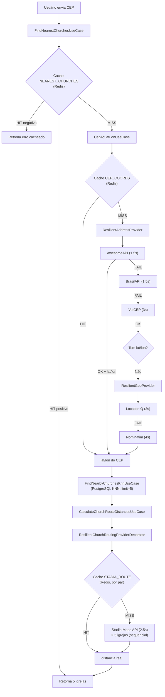

# Análise Completa — Fluxo "5 Igrejas Mais Próximas"

## 1. Visão Geral do Fluxo



---

## 2. O Objetivo Está Sendo Cumprido?

### ✅ SIM — O fluxo implementa corretamente o objetivo descrito:

| Requisito | Status | Implementação |
|---|---|---|
| Usuário envia CEP | ✅ | [find-nearest-churches-use-case.ts:38](file:///home/amaro/EvangelismoDigitalBackend/src/use-cases/churches/find-nearest-churches-use-case.ts#L38) |
| Busca endereço | ✅ | ResilientAddressProvider com 3 fallbacks (Awesome → Brasil → ViaCEP) |
| Busca geolocalização | ✅ | ResilientGeoProvider com 2 fallbacks (LocationIQ → Nominatim) |
| Otimização: AwesomeAPI dá lat/lon | ✅ | [cep-to-lat-lon-use-case.ts:77-84](file:///home/amaro/EvangelismoDigitalBackend/src/use-cases/churches/cep-to-lat-lon-use-case.ts#L77-L84) — pula geocoding |
| CEP errado → negative cache | ✅ | `ResilientCache.setResult()` com `negativeTtlSeconds: 1800` (30 min) |
| KNN → 5 igrejas | ✅ | [find-nearby-churches-knn-use-case.ts:36](file:///home/amaro/EvangelismoDigitalBackend/src/use-cases/churches/find-nearby-churches-knn-use-case.ts#L36) com `CHURCH_CONSTANTS.KNN_LIMIT = 5` |
| Church router calcula distâncias | ✅ | Stadia Maps API via `ResilientChurchRoutingProviderDecorator` |
| Sucesso → cache positivo | ✅ | `NEAREST_CHURCHES.DEFAULT_TTL_SECONDS = 7 dias` |

---

## 3. Estratégia de Cache — Análise Detalhada

### 3 Camadas de Cache

| Camada | Prefixo | TTL Positivo | TTL Negativo | O que cacheia |
|---|---|---|---|---|
| **L1**: CEP → Coords | `cache:cep-coords:` | 7 dias | 30 min | CEP → `{lat, lon, precision}` |
| **L2**: Stadia Route | `cache:stadia-route-distance:` | 7 dias | 0 (sem cache negativo) | Par (origem, destino) → distância |
| **L3**: Nearest Churches | `cache:nearest-churches:` | 7 dias | 30 min | CEP → 5 igrejas rankeadas |

> [!IMPORTANT]
> **Redundância de cache**: Na factory `makeFindNearestChurchesUseCase`, o `CepToLatLonUseCase` é criado com `cacheSuccessResults = false` (linha 87). Isso significa que o **L1 só faz negative cache** quando chamado dentro da orquestração de nearest churches. O cache positivo final é feito em **L3** (cobrindo tudo). Isso é correto — evita cache duplo.

### Envelope de Cache (Negative Cache)

O `ResilientCache` usa envelope `CacheEnvelope<T>`:
```ts
{ s: true,  v: resultado }   // Cache positivo
{ s: false, e: { type, message } }  // Cache negativo (erro serializado)
```

- Erros `RETRYABLE` (timeout, 503, etc.) → **NÃO são cacheados** (correto!)
- Erros `NOT_FOUND` ou de negócio (CEP inválido) → **SÃO cacheados por 30 min**

> [!TIP]
> Isso protege contra ataques de CEPs inválidos repetidos — não vai ficar chamando as APIs externas.

---

## 4. Análise de Timeouts — Orçamento de Tempo

### Mapa Completo de Timeouts

| Componente | Timeout Atual | Tipo |
|---|---|---|
| **HTTPS Agent** (todos providers) | 60.000ms | Socket inactivity |
| **Axios default** | 60.000ms | Fallback (não usado) |
| **AwesomeAPI** (Axios request) | 1.500ms | Request timeout |
| **BrasilAPI** (Axios request) | 1.500ms | Request timeout |
| **ViaCEP** (Axios request) | 3.000ms | Request timeout |
| **LocationIQ** (Axios request) | 2.000ms | Request timeout |
| **Nominatim** (Axios request) | 4.000ms | Request timeout |
| **Stadia Maps** (Axios request) | 2.500ms | Request timeout |
| **Retry backoff** (address) | 100ms × 2^attempt | Exponential |
| **Retry backoff** (geo) | 200ms × 2^attempt | Exponential |
| **Max retries** (todos) | 2 | Max attempts |
| **ResilientCache CEP_COORDS** | 25.000ms | Fetch timeout (AbortSignal) |
| **ResilientCache NEAREST_CHURCHES** | 25.000ms | Fetch timeout (AbortSignal) |
| **ResilientCache STADIA_ROUTE** | 2.500ms | Fetch timeout (per-pair) |

### Cenário de Pior Caso (Worst-Case Budget)

```
NEAREST_CHURCHES.fetchTimeout = 25s (orçamento global)
│
├── CepToLatLon (com cache próprio, fetchTimeout = 25s)
│   ├── Address: Awesome (1.5s×2 retries) + Brasil (1.5s×2) + ViaCEP (3s×2)
│   │   = até 12.6s (pior caso completo com backoff)
│   │
│   └── Geocoding: LocationIQ (2s×2 retries) + Nominatim (4s×2 retries)
│       = até 12.8s (com backoff)
│   
│   TOTAL Address+Geo: até ~25.4s
│
├── KNN (PostgreSQL): ~5-50ms
│
└── Routing: 5 × Stadia (2.5s sequencial, cada com cache)
    = até 12.5s
│
TOTAL TEÓRICO: ~38s (excede 25s!)
```

> [!CAUTION]
> **O timeout global de 25s pode ser insuficiente no pior caso extremo.** Se TODOS os address providers falharem com retry + TODOS os geo providers falharem com retry + 5 chamadas Stadia sem cache, o tempo total pode exceder 25s. Porém, o `AbortSignal` cascateado garante que o fluxo é **interrompido corretamente** quando o timeout expira.

---

## 5. Problemas Identificados e Recomendações

### 5.1 Timeout do HTTPS Agent vs Request

> [!WARNING]
> **HTTPS Agent timeout (60s) é muito alto comparado aos request timeouts (1.5-4s).**

O HTTPS Agent timeout é um **socket inactivity timeout** — se um socket ficar idle por 60s, é destruído. Isso é razoável para connection pooling. Porém, o `keepAliveMsecs: 1000` combinado com `timeout: 60000` significa que sockets ociosos vivem até 60s, consumindo recursos.

**Recomendação**: Reduzir para `30_000ms` — suficiente para connection reuse entre requests consecutivos sem desperdiçar recursos.

### 5.2 Timeouts de Axios por Provider

| Provider | Atual | Recomendado | Justificativa |
|---|---|---|---|
| AwesomeAPI | 1.500ms | **2.000ms** | APIs brasileiras podem ter latência variável. 1.5s é agressivo. |
| BrasilAPI | 1.500ms | **2.000ms** | Mesma razão. API pública com latência imprevisível. |
| ViaCEP | 3.000ms | **2.500ms** | ViaCEP costuma responder em <1s. 3s é conservador demais para um 3º fallback. |
| LocationIQ | 2.000ms | **2.500ms** | API paga, mas geocoding pode ser lento com endereços complexos. |
| Nominatim | 4.000ms | **3.000ms** | É o fallback final, mas 4s é excessivo. Nominatim público responde em 1-2s. |
| Stadia | 2.500ms | **2.500ms** ✅ | Adequado para routing API. |

> [!NOTE]
> **Best practice**: Timeouts de API HTTP devem ser **2-5x a latência p99 esperada**. Para APIs de geocoding brasileiras, a p99 típica é 500-1500ms.

### 5.3 Chamadas Stadia Sequenciais

> [!IMPORTANT]
> **As 5 chamadas Stadia são sequenciais** ([resilient-church-routing-provider.decorator.ts:50-56](file:///home/amaro/EvangelismoDigitalBackend/src/providers/church-routing-provider/decorators/resilient-church-routing-provider.decorator.ts#L50-L56)). No pior caso, isso são 5 × 2.5s = 12.5s.

A API Stadia suporta **matrix routing** (múltiplas origens/destinos em uma chamada). Isso reduziria 5 chamadas sequenciais para 1 única chamada.

**Recomendação futura**: Considerar migrar para `POST /sources_to_targets` da Stadia para batch.

### 5.4 ResilientCache CEP_COORDS não é usado para cache positivo (correto)

O `cacheSuccessResults = false` na factory garante que, quando chamado dentro de `FindNearestChurches`, o cache intermediário de CEP coords é deletado após sucesso. O cache positivo final é feito apenas em L3 (`cache:nearest-churches:`).

**Isso é correto** — evita que o sistema cache apenas o CEP→coords e nunca faça o KNN+routing quando o cache L3 expirar.

### 5.5 Timeout Budget Recomendado

Considerando um cenário de **experiência de usuário aceitável** (máximo ~10-15s para uma busca):

| Config | Atual | Sugestão |
|---|---|---|
| `NEAREST_CHURCHES.FETCH_TIMEOUT_MS` | 25.000 | **15.000** |
| `CEP_COORDS.FETCH_TIMEOUT_MS` | 25.000 | **10.000** |
| `STADIA_ROUTE.FETCH_TIMEOUT_MS` | 2.500 | **2.500** ✅ |

**Justificativa**: 25s de timeout para uma requisição HTTP do usuário é excessivo. Na prática, se o fluxo demorar mais de 10-15s, o usuário já desistiu ou o frontend já mostrou timeout. Com `AbortSignal.any()` garantindo cascateamento, o timeout de L3 (15s) naturalmente aborta L1 internamente.

---

## 6. Resumo

### O que funciona bem ✅

1. **Fallback chains** — Address (3 providers) e Geo (2 providers) com failureMode routing
2. **Negative cache** — CEPs inválidos são cacheados por 30 min, protegendo APIs externas
3. **Rate limiting** — Cada provider tem seu próprio rate limit global via Redis
4. **Envelope de cache** — Suporta cache de sucesso E de falha no mesmo formato
5. **AbortSignal cascading** — Timeout global propaga para todos os sub-providers
6. **Cache positivo L3** — CEP → 5 igrejas com TTL de 7 dias (primeira busca é cara, subsequentes são O(1))
7. **Otimização AwesomeAPI** — Se já retorna lat/lon, pula geocoding inteiramente

### O que pode melhorar ⚠️

1. **Timeouts de provider** — Ligeira calibração (ver tabela 5.2)
2. **Timeout global** — 25s é alto para UX; considerar reduzir para 15s
3. **HTTPS Agent timeout** — 60s → 30s
4. **Stadia sequencial** — 5 chamadas sequenciais poderiam ser batch
5. **Nominatim timeout** — 4s é alto; 3s seria suficiente
