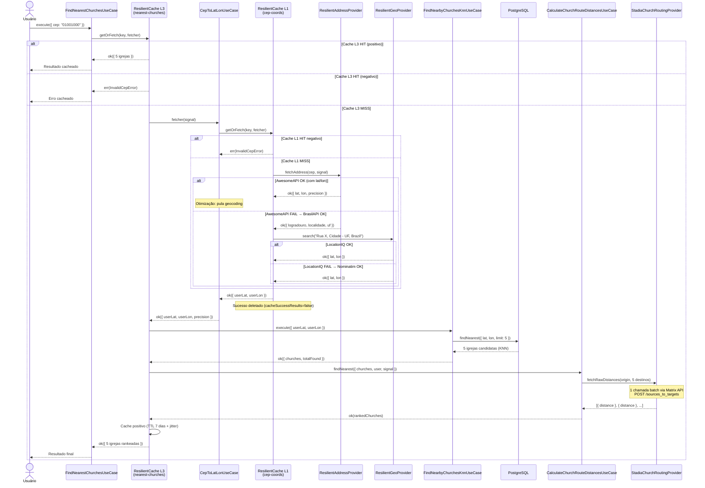
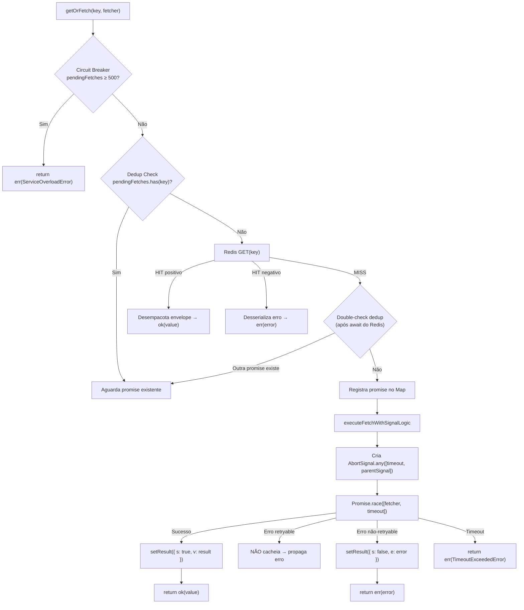
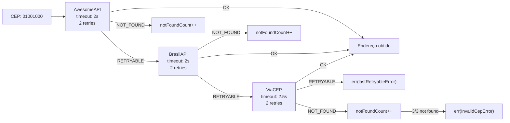
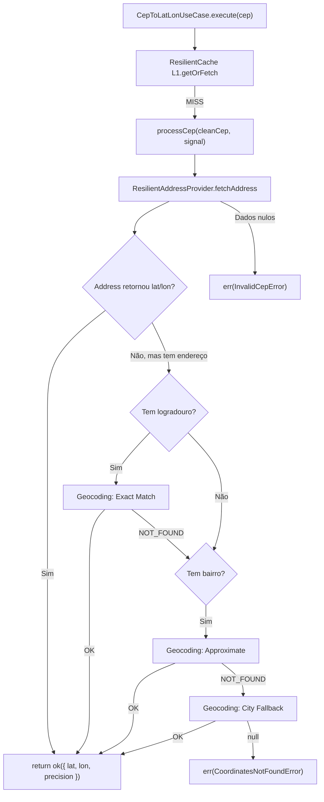
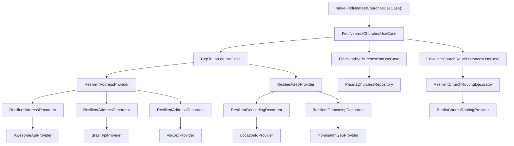

# Fluxo de Busca das 5 Igrejas Mais Próximas via CEP

## Índice

1. [Visão Geral do Fluxo](#1-visão-geral-do-fluxo)
2. [Diagrama de Sequência Completo](#2-diagrama-de-sequência-completo)
3. [Camada de Cache (ResilientCache)](#3-camada-de-cache-resilientcache)
4. [Etapa 1: Resolução de CEP para Coordenadas](#4-etapa-1-resolução-de-cep-para-coordenadas)
5. [Etapa 2: KNN — Busca Espacial no PostgreSQL](#5-etapa-2-knn--busca-espacial-no-postgresql)
6. [Etapa 3: Cálculo de Distâncias Reais (Stadia Matrix)](#6-etapa-3-cálculo-de-distâncias-reais-stadia-matrix)
7. [Composição via Factory](#7-composição-via-factory)
8. [Mapa de Timeouts](#8-mapa-de-timeouts)
9. [Proteções de Resiliência](#9-proteções-de-resiliência)
10. [Referência de Arquivos](#10-referência-de-arquivos)

---

## 1. Visão Geral do Fluxo

O sistema recebe um **CEP** e retorna as **5 igrejas mais próximas**, ranqueadas por distância real de caminhada.

O fluxo é composto por 3 etapas sequenciais, orquestradas pelo use case `FindNearestChurchesUseCase`:

```
CEP → [Endereço + Geolocalização] → [KNN PostgreSQL] → [Distâncias Reais via Stadia] → 5 igrejas rankeadas
```

Todo o resultado final é cacheado: se o mesmo CEP for consultado novamente, a resposta vem diretamente do Redis, sem nenhuma chamada externa.

---

## 2. Diagrama de Sequência Completo



---

## 3. Camada de Cache (ResilientCache)

O `ResilientCache` é a peça central de resiliência do sistema. Ele implementa **cache positivo e negativo** com envelope tipado, deduplicação de requests concorrentes, circuit breaker, e timeout global via `AbortSignal`.

### 3.1 Estrutura de Envelope

Todo valor armazenado no Redis segue uma estrutura de envelope:

```typescript
// Cache POSITIVO (sucesso)
{ s: true, v: { nearestChurchesInfo: [...], totalFound: 5, ... } }

// Cache NEGATIVO (erro de negócio)
{ s: false, e: { type: "InvalidCepError", message: "CEP inválido", data: {...} } }
```

O campo `s` (state) determina se o envelope contém um resultado de sucesso (`v`) ou de falha (`e`).

### 3.2 Instâncias de Cache no Fluxo

O sistema utiliza **2 instâncias** de `ResilientCache`:

| Instância | Prefixo Redis | TTL Positivo | TTL Negativo | Fetch Timeout | O que cacheia |
|---|---|---|---|---|---|
| **L1** (CEP → Coords) | `cache:cep-coords:` | 7 dias* | 30 min | 10s | CEP → `{lat, lon, precision}` |
| **L3** (CEP → 5 Igrejas) | `cache:nearest-churches:` | 7 dias | 30 min | 15s | CEP → resultado final completo |

> **\* Nota sobre L1:** Na factory, o `CepToLatLonUseCase` é criado com `cacheSuccessResults = false`. Isso significa que, quando o use case retorna **sucesso**, o cache L1 positivo é **imediatamente deletado** (`redis.del(cacheKey)`). Apenas o **cache negativo** persiste no L1. O cache positivo do fluxo completo fica no **L3**.

**Justificativa:** Se o L1 cacheasse o sucesso e o L3 expirasse, o sistema teria coordenadas mas não as igrejas — precisaria refazer KNN + Stadia. Como L3 já contém tudo, cachear L1 positivo seria redundante.

### 3.3 Geração de Chave

A chave é um hash SHA-256 dos parâmetros ordenados, precedido pelo prefixo:

```typescript
// L1: apenas o CEP
generateKey({ cep: "01001000" })
// → "cache:cep-coords:sha256(cep:01001000)"

// L3: CEP + perfil de rota
generateKey({ cep: "01001000", profile: "pedestrian" })
// → "cache:nearest-churches:sha256(cep:01001000|profile:pedestrian)"
```

### 3.4 Fluxo Interno do `getOrFetch`



### 3.5 Decisão de Cache Negativo

O `ResilientCache` **não cacheia todos os erros**. A lógica é:

```typescript
// Função customizável via options.isRetryable
// Default: erro é retryable se error.failureMode === 'RETRYABLE'

if (!isRetryable(error)) {
  // Cacheia o erro (negativo) — ex: InvalidCepError, CoordinatesNotFoundError
  await this.setResult(key, { s: false, e: serializer(error) })
}
// Se é retryable (timeout, 503, etc.) → NÃO cacheia, permite retry futuro
```

| Tipo de Erro | `failureMode` | É cacheado? | TTL |
|---|---|---|---|
| `InvalidCepError` | — | ✅ Sim | 30 min |
| `CoordinatesNotFoundError` | `NOT_FOUND` | ✅ Sim | 30 min |
| `TimeoutExceededError` | `RETRYABLE` | ❌ Não | — |
| `ServiceBusyError` | `RETRYABLE` | ❌ Não | — |
| `ProviderFailureError` (503) | `RETRYABLE` | ❌ Não | — |

### 3.6 Serialização/Desserialização de Erros

O sistema usa um `AppErrorRegistry` para serializar e desserializar erros no cache:

```typescript
// Serialização (ao gravar no Redis)
serializeAppError(err) → { type: "InvalidCepError", message: "...", data: {...} }

// Desserialização (ao ler do Redis)
deserializeAppError("InvalidCepError", "...", data) → new InvalidCepError()
```

Isso garante que erros cacheados são reconstruídos como instâncias tipadas, preservando `failureMode`, `statusCode` e outras propriedades.

### 3.7 TTL Jitter

Para evitar **cache stampede** (muitas chaves expirando ao mesmo tempo), o TTL final recebe um jitter de ±5%:

```typescript
const jitterAmount = Math.floor(baseTtl * 0.05)
const randomOffset = Math.floor(Math.random() * (jitterAmount * 2 + 1)) - jitterAmount
const finalTtl = Math.max(1, baseTtl + randomOffset)
// TTL de 7 dias (604800s) → varia entre ~574.560s e ~635.040s
```

### 3.8 Deduplicação de Requests Concorrentes

O `ResilientCache` usa um `Map<string, Promise>` em memória para deduplicar chamadas concorrentes ao mesmo recurso:

```
Request A: CEP 01001000 → MISS → inicia fetch, registra no Map
Request B: CEP 01001000 → detecta no Map → aguarda promise de A
Request C: CEP 01001000 → detecta no Map → aguarda promise de A
                                          ↓
                            A resolve → B e C recebem mesmo resultado
```

Há um **double-check pattern**: após o `await redis.get()`, verifica novamente se outra promise surgiu durante o I/O assíncrono.

---

## 4. Etapa 1: Resolução de CEP para Coordenadas

O `CepToLatLonUseCase` converte um CEP em coordenadas geográficas (lat/lon) através de uma cadeia de providers com fallback.

### 4.1 Providers de Endereço (Address Providers)

Ordem de tentativa: **AwesomeAPI → BrasilAPI → ViaCEP**



Cada provider é envelopado por um **decorator resiliente** que adiciona:
- **Rate limiting** via Redis (global por provider)
- **Retry com backoff exponencial** (2 tentativas, 100-200ms base)
- **AbortSignal propagation** (respeita timeout do pai)

**Otimização**: Se o AwesomeAPI retornar `lat/lon` junto com o endereço, o geocoding é completamente pulado.

### 4.2 Providers de Geocoding (quando necessário)

Se o address provider não retornou coordenadas, o sistema tenta geocodificar o endereço:

Ordem de tentativa: **LocationIQ → Nominatim**

O geocoding usa 3 estratégias de refinamento progressivo:

| Estratégia | Query | Quando usada |
|---|---|---|
| **A: Exact** | `"Rua X, Cidade - UF, Brazil"` | Quando `logradouro` existe |
| **B: Approximate** | `"Bairro, Cidade - UF, Brazil"` | Quando `bairro` existe |
| **C: City** | Structured: `{ city, state, country }` | Fallback final |

Se a Estratégia A retornar `NOT_FOUND`, tenta B. Se B retornar `NOT_FOUND`, tenta C. Erro `RETRYABLE` em qualquer estratégia aborta imediatamente.

### 4.3 Fluxo Completo do CEP



---

## 5. Etapa 2: KNN — Busca Espacial no PostgreSQL

O `FindNearbyChurchesKnnUseCase` faz uma busca **K-Nearest Neighbors** no PostgreSQL para encontrar as 5 igrejas mais próximas geometricamente (distância euclidiana no plano geográfico).

```typescript
await this.churchesRepository.findNearest({
  userLat,
  userLon,
  limit: CHURCH_CONSTANTS.KNN_LIMIT, // 5
})
```

- **Input**: lat/lon do usuário
- **Output**: 5 igrejas candidatas com `{ lat, lon, nome, ... }`
- **Tempo típico**: 5-50ms
- **Validação**: latitude ∈ [-90, 90], longitude ∈ [-180, 180]

> **Nota**: KNN retorna distâncias geométricas (linha reta). As distâncias reais de caminhada são calculadas na etapa seguinte.

---

## 6. Etapa 3: Cálculo de Distâncias Reais (Stadia Matrix)

O `CalculateChurchRouteDistancesUseCase` calcula as distâncias reais de caminhada entre o usuário e cada uma das 5 igrejas usando a API Matrix do Stadia Maps.

### 6.1 Chamada Batch

Em vez de 5 chamadas sequenciais, o sistema faz **1 única chamada** via `POST /sources_to_targets`:

```json
// Request
{
  "sources": [{ "lat": -23.5505, "lon": -46.6333 }],
  "targets": [
    { "lat": -23.551, "lon": -46.634 },
    { "lat": -23.560, "lon": -46.640 },
    { "lat": -23.570, "lon": -46.650 },
    { "lat": -23.580, "lon": -46.660 },
    { "lat": -23.590, "lon": -46.670 }
  ],
  "costing": "pedestrian",
  "units": "kilometers"
}

// Response
{
  "sources_to_targets": [
    [
      { "distance": 0.8, "time": 600 },
      { "distance": 1.2, "time": 900 },
      { "distance": 2.5, "time": 1800 },
      { "distance": 3.1, "time": 2200 },
      { "distance": 4.7, "time": 3400 }
    ]
  ]
}
```

### 6.2 Proteções do Decorator

O `ResilientChurchRoutingProviderDecorator` adiciona:
- **Rate limiting** global via Redis (50 req/s)
- **AbortSignal check** antes da chamada
- **Error mapping** via `FindNearestChurchesErrorMapper`

### 6.3 Ranking Final

Após receber as distâncias, o sistema:
1. Filtra destinos inalcançáveis (`distance == null` ou `status !== 0`)
2. Ordena por `distanceKm` crescente
3. Enriquece cada igreja com `distanceKm` e `distanceMeters`
4. Retorna o array ordenado

---

## 7. Composição via Factory

O `makeFindNearestChurchesUseCase()` é a factory singleton que monta toda a árvore de dependências:



A factory é um **singleton** — a instância é criada uma vez e reutilizada:

```typescript
let cachedUseCase: FindNearestChurchesUseCase | null = null

export function makeFindNearestChurchesUseCase(...) {
  if (cachedUseCase) return cachedUseCase
  // ... monta tudo ...
  cachedUseCase = useCase
  return cachedUseCase
}
```

---

## 8. Mapa de Timeouts

### 8.1 Timeout Budget Completo

```
┌─────────────────────────────────────────────────────────────┐
│  L3 ResilientCache: fetchTimeout = 15s (orçamento global)   │
│                                                             │
│  ┌──────────────────────────────────────────────────┐       │
│  │  L1 ResilientCache: fetchTimeout = 10s            │       │
│  │                                                    │       │
│  │  Address Chain (worst case):                       │       │
│  │    AwesomeAPI: 2s × 2 retries = ~4.2s              │       │
│  │    BrasilAPI:  2s × 2 retries = ~4.2s              │       │
│  │    ViaCEP:     2.5s × 2 retries = ~5.4s            │       │
│  │                                                    │       │
│  │  Geocoding Chain (worst case):                     │       │
│  │    LocationIQ: 2.5s × 2 retries = ~5.4s            │       │
│  │    Nominatim:  3s × 2 retries = ~6.6s              │       │
│  └──────────────────────────────────────────────────┘       │
│                                                             │
│  KNN PostgreSQL: ~5-50ms                                    │
│                                                             │
│  Stadia Matrix Batch: 3s (1 chamada)                        │
└─────────────────────────────────────────────────────────────┘
```

### 8.2 Tabela de Timeouts por Componente

| Componente | Timeout | Retries | Backoff Base | Tipo |
|---|---|---|---|---|
| AwesomeAPI | 2.000ms | 2 | 100ms | Axios request |
| BrasilAPI | 2.000ms | 2 | 100ms | Axios request |
| ViaCEP | 2.500ms | 2 | 200ms | Axios request |
| LocationIQ | 2.500ms | 2 | 200ms | Axios request |
| Nominatim | 3.000ms | 2 | 200ms | Axios request |
| Stadia Matrix | 3.000ms | — | — | Axios request |
| HTTPS Agent | 30.000ms | — | — | Socket inactivity |
| L1 Cache (CEP) | 10.000ms | — | — | AbortSignal fetch timeout |
| L3 Cache (Igrejas) | 15.000ms | — | — | AbortSignal fetch timeout |

### 8.3 Cascateamento de AbortSignal

```
L3 cria AbortSignal.timeout(15s)
  → passado como parentSignal para o fetcher
    → L1 cria AbortSignal.any([timeout(10s), parentSignal(L3)])
      → effectiveSignal dispara quando QUALQUER um expira
        → propagado para Address/Geo providers via signal
          → Axios usa signal para cancelar HTTP requests
```

Se L3 expirar (15s), **todas as operações internas são canceladas** imediatamente.

---

## 9. Proteções de Resiliência

### 9.1 Circuit Breaker (in-memory)

Cada `ResilientCache` tem um circuit breaker por `maxPendingFetches`:

```typescript
if (this.pendingFetches.size >= this.MAX_PENDING) {
  return err(new InfraServiceOverloadError())
}
```

Se houver 500+ fetches pendentes, novas requisições são rejeitadas imediatamente.

### 9.2 Rate Limiting (Redis)

Cada provider externo tem seu próprio rate limiter global via Redis:

| Provider | Limit | Janela |
|---|---|---|
| AwesomeAPI | 5 req | 1s |
| BrasilAPI | 5 req | 1s |
| ViaCEP | 1 req | 1s |
| LocationIQ (geo) | 2 req | 1s |
| Nominatim | 1 req | 1s |
| Stadia | 50 req | 1s |

O rate limiter usa **fail-open em falha de Redis** — se Redis estiver indisponível, as requisições passam para não bloquear o sistema.

### 9.3 Fallback Chains

| Camada | Providers | Lógica de Fallback |
|---|---|---|
| Address | Awesome → Brasil → ViaCEP | Avança no `RETRYABLE`, para no `NOT_FOUND` |
| Geocoding | LocationIQ → Nominatim | Avança no `RETRYABLE`, para no `NOT_FOUND` |
| Geocoding Strategies | Exact → Approximate → City | Avança no `NOT_FOUND`, para no `RETRYABLE` |
| Routing | Stadia (único) | Sem fallback (provider único) |

### 9.4 Retry com Backoff Exponencial

Os decorators de Address e Geocoding implementam retry com backoff:

```typescript
const delay = this.rawProvider.backoffMs * Math.pow(2, attempt - 1)
// attempt 1: 100ms (ou 200ms)
// attempt 2: 200ms (ou 400ms)
```

O retry respeita o `AbortSignal` — se o timeout global expirar durante o backoff, o sleep é cancelado.

### 9.5 Graceful Degradation no Redis

Se Redis falhar durante leitura/escrita de cache:
- **Leitura**: Erro é logado e ignorado → prossegue para o fetch
- **Escrita**: Erro é logado e ignorado → resultado é retornado sem cache
- **Rate Limiter**: Fail-open → requisição é permitida

---

## 10. Referência de Arquivos

### Use Cases
| Arquivo | Responsabilidade |
|---|---|
| [find-nearest-churches-use-case.ts](file:///home/amaro/EvangelismoDigitalBackend/src/use-cases/churches/find-nearest-churches-use-case.ts) | Orquestrador principal (L3 cache) |
| [cep-to-lat-lon-use-case.ts](file:///home/amaro/EvangelismoDigitalBackend/src/use-cases/churches/cep-to-lat-lon-use-case.ts) | CEP → coordenadas (L1 cache) |
| [find-nearby-churches-knn-use-case.ts](file:///home/amaro/EvangelismoDigitalBackend/src/use-cases/churches/find-nearby-churches-knn-use-case.ts) | Busca KNN no PostgreSQL |
| [calculate-church-route-distances-use-case.ts](file:///home/amaro/EvangelismoDigitalBackend/src/use-cases/churches/calculate-church-route-distances-use-case.ts) | Ranking por distância real |

### Providers
| Arquivo | Responsabilidade |
|---|---|
| [resilient-address-provider.ts](file:///home/amaro/EvangelismoDigitalBackend/src/providers/address-provider/resilient-address-provider.ts) | Cadeia de fallback de endereços |
| [resilient-geo-provider.ts](file:///home/amaro/EvangelismoDigitalBackend/src/providers/geo-provider/resilient-geo-provider.ts) | Cadeia de fallback de geocoding |
| [stadia-church-routing-provider.ts](file:///home/amaro/EvangelismoDigitalBackend/src/providers/church-routing-provider/stadia-church-routing-provider.ts) | Batch matrix routing via Stadia |

### Decorators
| Arquivo | Responsabilidade |
|---|---|
| [resilient-address-provider.decorator.ts](file:///home/amaro/EvangelismoDigitalBackend/src/providers/address-provider/decorators/resilient-address-provider.decorator.ts) | Rate limit + retry para address |
| [resilient-geocoding-provider.decorator.ts](file:///home/amaro/EvangelismoDigitalBackend/src/providers/geo-provider/decorators/resilient-geocoding-provider.decorator.ts) | Rate limit + retry para geocoding |
| [resilient-church-routing-provider.decorator.ts](file:///home/amaro/EvangelismoDigitalBackend/src/providers/church-routing-provider/decorators/resilient-church-routing-provider.decorator.ts) | Rate limit + error mapping para routing |

### Infraestrutura
| Arquivo | Responsabilidade |
|---|---|
| [resilient-cache.ts](file:///home/amaro/EvangelismoDigitalBackend/src/lib/infra/cache/resilient-cache.ts) | Cache positivo/negativo com dedup e timeout |
| [redis-rate-limiter.ts](file:///home/amaro/EvangelismoDigitalBackend/src/lib/infra/rate-limiter/redis-rate-limiter.ts) | Rate limiting global por provider |
| [app-error-registry.ts](file:///home/amaro/EvangelismoDigitalBackend/src/errors/app-error-registry.ts) | Serialização/desserialização de erros |

### Configuração
| Arquivo | Responsabilidade |
|---|---|
| [cache.ts](file:///home/amaro/EvangelismoDigitalBackend/src/messages/constants/cache/cache.ts) | TTLs, prefixos, timeouts de cache |
| [churches.ts](file:///home/amaro/EvangelismoDigitalBackend/src/messages/constants/churches/churches.ts) | KNN_LIMIT, GEOCODING_COUNTRY |
| [make-find-nearest-churches-use-case.ts](file:///home/amaro/EvangelismoDigitalBackend/src/use-cases/factories/make-find-nearest-churches-use-case.ts) | Factory singleton |
